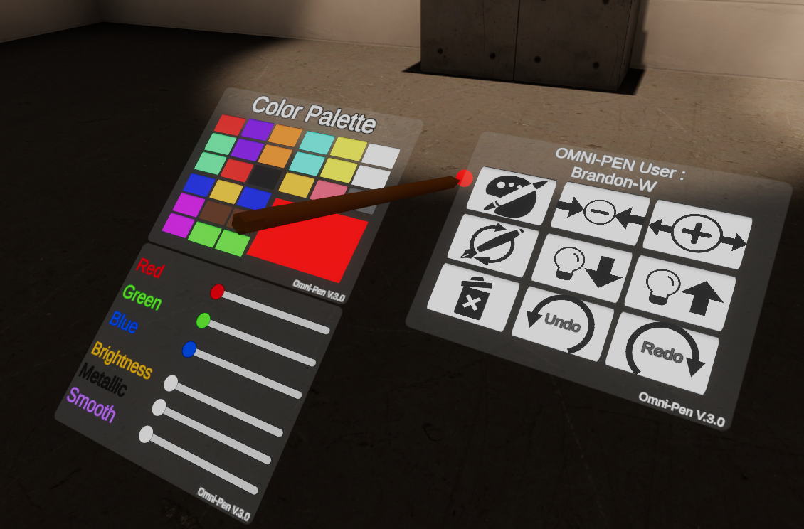

# Massive Loop | Omni-Pen

Omni Pen
The Omni Pen is a fully-featured, network-synchronized drawing and world-interaction tool designed for Massive Loop.

It allows players to draw in 3D space, customize materials in real time, edit their strokes, and maintain consistent visuals and state across multiplayer sessions.

## **Key Mechanics**  

### **The Drawing System**

The pen draws by spawning prefabs (usually line or trail renderers) as the player holds the trigger:

- When **Primary Trigger Down** is pressed, a new line segment is created.
- As the pen moves, new points are appended to the LineRenderer.
- On release, the completed line is stored so the player can undo/redo.

The drawing system supports:

- Smooth, continuous line creation
- Shared material instances so all segments from a pen share the same color/emissive settings
- Adjustable width, dynamically applied to future lines

****

The drawing system is built around continuous line construction that updates every physics tick, allowing strokes to appear fluid and responsive in VR. By storing each completed line as a separate object, the system can manage a full edit history while keeping performance stable. The use of shared material instances ensures that even complex drawings remain efficient, as reducing material overhead is important when users create many strokes in multiplayer environments.

### **The Color System**

The Omni Pen supports two ways of changing color:

1. **Cycling through predefined color presets (drawn prefabs)**
2. **Fine-grained RGB control using sliders**

Each pen maintains its own **material instance**, ensuring:

- Each player has independent control
- Color changes affect previews and new line segments
- Updates are efficient and consistent

Color selections are also synced to other players via network events.

The color system is designed to feel like a professional creative tool, giving players both rapid preset switching and precise manual tuning. By generating per-pen material instances, each user can freely edit color without impacting others. This also ensures high-fidelity visual accuracy in multiplayer, since the pen broadcasts exact values to other clients, keeping drawings consistent no matter who is viewing them.

****

### **Emission, Metallic, and Smoothness Controls**

The pen allows full real-time material customization:

- **Emission Intensity** (0.1 → 3.0)
- **Metallic** value
- **Smoothness/Glossiness**

Each slider updates:

- The local pen’s material
- The color preview sphere
- All clients in the session via networked events

This gives the user near-shader-graph levels of control directly through the pen.

These material controls turn the Omni-Pen into a dynamic creative instrument capable of producing everything from matte markers to glowing neon strokes. By directly modifying key shader parameters and syncing these changes over the network, the system ensures that all visual variation is preserved across clients. The inclusion of emission, metallic, and smoothness creates a sense of artistic expressiveness that goes far beyond simple color selection.

****

### **Width Control**

Two buttons allow the user to increase or decrease stroke thickness.

- Adjusts `currentWidthMultiplier`
- Updates the size preview orb
- Applies to all newly drawn lines

Changes are also broadcast to other players.

Width control lets players express themselves through line variation, mimicking real-world art tools such as markers, brushes, and chalk. The system keeps the scaling consistent by previewing changes and applying them only to future strokes, giving players predictable behavior. Network syncing ensures every participant sees the same thickness, maintaining visual clarity and fairness in collaborative drawing sessions.

------

### **Undo / Redo System**

The pen includes a full history stack:

- **Undo** hides the most recent stroke
- **Redo** restores previously undone strokes
- Both actions sync with the network (PenUndo / PenRedo events)

Internally, this uses two stacks:

- `undoStack`
- `redoStack`

This makes drawing reversible and multiplayer-consistent.

Undo and redo support transforms the pen from a simple drawing toy into a serious creative tool. Artists and builders can experiment without fear, knowing that mistakes are reversible. The dual-stack system is lightweight yet robust, allowing fast switching between states while ensuring all clients maintain identical drawing histories through synchronized events.

****

### **Clearing All Drawings**

One button removes **all strokes** created by that pen.

- Deletes both undo and redo stacks
- Notifies all players
- Fully resets that user’s pen-generated content

**How this tackles the concept:**
Clearing all lines gives users a clean slate instantly, which is particularly important during collaborative sessions or demos where many users draw simultaneously. This function ensures each pen manages only its own content, preventing accidental deletion of another player's work. By syncing this action over the network, all participants see the drawing space reset at the same moment.

### **Surface Grab Toggle**

The pen can switch between **free-air drawing** and **surface snapping**.

- Uses the MLGrab `SurfaceGrab` boolean
- Lets the user smoothly write on walls, floors, or tables when enabled

Surface Grab offers precision for users who want to draw directly onto existing geometry, turning any object into a potential canvas. This makes the Omni-Pen flexible for signage, labeling, puzzles, or environmental editing. Toggling this mode dynamically allows seamless switching between freeform 3D strokes and grounded surface-based drawing.

****

### **Dynamic Color Menu UI**

The color selector opens a UI menu that smoothly expands/contracts.

- Uses an animated scaling coroutine
- Displays buttons for each preset color
- Updates UI button preview colors based on actual material values

The animated UI provides a polished user experience that feels intuitive and pleasant to interact with. The design keeps the pen compact during use while allowing quick access to detailed customization options. By dynamically updating button colors to match the active material, the UI maintains clarity and avoids confusion, especially during multiplayer sessions.

****

### **Late Joiner Synchronization**

When a new player joins:

- The master client sends the pen's current color and settings
- The late joiner applies them locally

This ensures the pen always looks correct, even for players arriving mid-session.

Late joiner support ensures visual consistency in long-running multiplayer environments. Without this system, new players would see incorrect strokes, mismatched colors, or outdated pen settings. By immediately broadcasting the pen state to newcomers, the system guarantees that all participants share the same creative context from the moment they enter the world.

****

### **Pen Reset Functionality**

A reset button restores the pen to its original world position and rotation.

- Stored in `OriginPosition` / `OriginRotation`
- Called via `ResetPen()`

This helps players recover lost or misplaced pens.

In active multiplayer worlds, tools can easily be dropped, thrown, or misplaced. The reset feature ensures players never lose their pen or become stuck without access to it. By restoring the original orientation as well, the system guarantees a predictable and clean recovery every time.

****

#### **Player Labeling**

When grabbed, the pen updates a small UI label:

- Displays “OMNI-PEN User: [Player Name]”
- Helps in multiplayer scenarios to identify who is using which pen

**How this tackles the concept:**
Player labeling enhances clarity in group settings by showing ownership of each pen in real time. This prevents confusion between multiple pens lying around and helps users coordinate during collaborative drawing sessions. It also adds a personalized touch to the tool, reinforcing identity and teamwork.

#### **Multiplayer Event System**

The Omni Pen relies heavily on Massive Loop’s event tokens:

- Color changes
- Width changes
- Emission/metallic/smoothness updates
- Undo, redo, clear
- Late joiner updates

Every meaningful action is synchronized.

The event system is the backbone of the pen’s multiplayer functionality. By sending lightweight, targeted events for every parameter change, the system ensures users always see accurate, up-to-date drawing behavior from others. This architecture allows for efficient network usage while maintaining a highly interactive, shared creative environment.

---

## 
